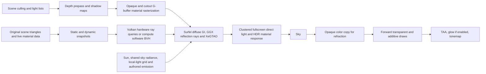

# Kiln renderer architecture and contract

Fixed upstream: Godot 4.7.2-stable, `ed1daf0bf001b61586d9930840f2f1394092c079`.
The `kiln_deferred` selector constructs the clustered renderer with a distinct
opaque pass. It preserves upstream culling, cluster construction, shadow maps,
sky, alpha sorting, exposure, TAA and tonemapping. It does not run the ordinary
Forward+ opaque color draw. The Forward+ selector remains separately runnable.

For Forward+ comparisons, the same native GI runs after its depth/normal prepass,
before its opaque color pass. `kiln_surface` evaluates the same authored direct
BRDF and native indirect response in both renderers. Shader scripts supply
reflectance and genuine emission; they do not inject already-lit GI into EMISSION.

## G-buffer data

One depth-tested opaque/cutout material pass writes the following attachments.
It evaluates the original Godot material, retaining vertex deformation, implicit
texture derivatives, normal maps and cutout coverage. There is no visibility-ID
prepass, primitive-ID buffer, identity discard, or geometry material replay.

| Attachment | Format | Meaning |
| --- | --- | --- |
| 0 | RGBA8 UNORM | Linear albedo RGB, metallic A |
| 1 | RGBA16F | Signed view shading normal XYZ, perceptual roughness W |
| 2 | RGBA16F | Authored, unexposed emission RGB |
| 3 | RGBA8 UNORM | Specular, AO, AO direct influence, scalar leaf backlight |
| 4 | RG32 UINT | Draw instance +1 / BRDF flag, packed geometric normal |
| 5 | RG16F | Previous minus current unjittered screen UV |

Depth uses reversed Z. Material A reserves 1 for unshaded; scalar backlight is
clamped below .5. Surface metadata exists to select instance lighting layers and
keep the world cache on the geometric surface, not to reconstruct materials.
The upstream depth prepass remains available for culling and clustering.

The fullscreen pass reconstructs view position from depth, fetches the stored
instance's layer mask, and uses upstream clustered bitmasks and shadow samplers.
It binds no writable depth attachment while sampling depth. No per-pixel
unconditional loop over all local lights is introduced. Counts use the same
2048 per-type capacity in the demo; upload overflow is counted and warned.

## GI scene and resource interface

`KilnGIWorld` is a native scene node, bound to an Environment. Its parent subtree
provides geometry and local lights. `kiln_dynamic=true` marks rigid dynamic
subtrees; `kiln_exclude=true` excludes auxiliary geometry. Mesh arrays are cached
per mesh identity and surface directly from the original vertex/index arrays.
No simplified proxy resource is generated or serialized by the importers.
Legacy proxy import settings are invalidated for reimport.
Changes to geometry resources, transforms and visibility are detected
automatically; material and texture edits update the affected transport attributes
without rebuilding the hierarchy. `rebuild()` explicitly invalidates the caches.
Low-level GPU-only deformation without resource notification remains unsupported.
Separate static/dynamic geometry and material revisions prevent an animated
emitter from uploading the entire static world. Unused resources release their
cached geometry and signal connections.

Supported Vulkan devices build separate static/dynamic BLAS and a TLAS and use
inline hardware ray queries. Committed instance/primitive IDs address the same
packed transport materials. Geometry changes rebuild the affected subtree;
material-only edits do not rebuild acceleration structures. This is currently
packed subtree geometry rather than reusable per-object BLAS instances.

The fallback uses CPU binned SAH to determine a threaded topology. A bottom-up
compute pass builds its bounds, then GPU nearest-hit/visibility kernels query it
using 80-byte packed triangles. Static and dynamic trees share traversal.
Explicit diagnostic captures compare 2,048 GPU hardware/software queries.
Local bounce selects a light
by incident-power importance sampling with inverse-PDF weighting and BVH visibility.
Emitter area/power CDFs provide explicit next-event samples. Material emission,
direct light and indirect transport remain separate.

GPU stages: anchored surfel update/free-list creation, three-level hashed grid
build, coverage-driven allocation, grid rebuild, ray tracing, upstream MSME
integration, full-resolution gathering and temporal publication. XeGTAO remains
independent. Static surfels persist; reordered dynamic triangles invalidate their
anchors and regenerate visible surface entries. Allocation and cell traversal are
bounded by a viewport-scaled 65,536–262,144-entry pool. Geometry normals drive the cache while normal maps
remain available to direct material shading.

The ray pass reads the previous irradiance cache; the integration dispatch writes
the next values. Recursive diffuse feedback is controlled by
`rendering/kiln/surfel_multibounce`.

A separate full-resolution pass samples GGX visible microfacet normals from the
receiver's shading normal, view and perceptual roughness. Rays intersect original
scene meshes, including objects outside the camera frustum. Hit radiance contains
emission, shadowed sun/local direct illumination and surfel-cached diffuse GI;
new/offscreen surfaces trace sky and emissive illumination if the cache has no
support. Misses sample the shared sky. Two Schlick RGB integrals are retained so
material F0/F90 and upstream multiple-scattering compensation can be applied once
in either the deferred resolve or Forward+. This is a radiance integral, not a
blur of the final screen or a copy of diffuse GI. The independent reflection
filter rejects receiver position/normal/roughness and hit-distance changes, clips
history to a local neighborhood, reduces history under motion and invalidates it
for changed geometry/lighting. Ray-occluded specular is not multiplied by screen AO.
`rendering/kiln/surfel_specular` and `rendering/kiln/specular_rays` control it;
reflection rays use a separate 1–8 samples/pixel budget (default 2).
Per-viewport resources are freed on resize/reconfiguration. Output readbacks occur
only on explicit `request_capture(directory)` and are excluded from benchmarks.

`set_lighting` supplies linear sun color, sun/sky energy, direction and TOD.
`set_sky` selects the shared procedural sky or original reference sky model.
`set_quality(rays, samples)` exposes quality levels 1–8 (4–32 rays per updated
surfel) and a 16–1024 sample convergence budget. Explicit lighting changes use
at least 16 rays per updated surfel. Mature stationary surfels update one quarter
of the pool per frame.
`set_enabled`, `set_ao_enabled`, `reset_history`, `get_statistics`, and
`set_profiling` support controls and checks. `set_query_backend(0)` selects
automatically, `1` forces software and `2` prefers hardware with fallback.
Hardware ray capability is queried from the active RD and statistics report
the actual backend. Windows Vulkan hardware ray queries are implemented and
tested. The earlier M5 Metal device reported both capabilities unsupported;
this change does not implement a Metal hardware backend.

Both query backends consume the same world/light snapshot contract.
Stochastic direct lighting can consume the same cluster/light
input, but is not implemented here. No MegaLights or ReSTIR claim is made.

## Explicit limits

MSAA, multiview/XR and reflection-probe capture are rejected in Kiln deferred.
Unsupported opaque custom `light()`, clearcoat, anisotropy, rim, SSS, bent normals,
nonstandard depth/stencil and toon modes are diagnosed and omitted, not silently
sent through Forward+ opaque rendering. Existing renderers retain their behavior.

The native GI geometry capture currently supports rigid MeshInstance3D geometry
and uniform authored albedo/emission. Shader materials explicitly declare
`kiln_uniform_transport=true` with `tint_linear`, `authored_emission` and
`metalness` constants. This is an opt-in contract that the shader author must
honor; it does not certify arbitrary shader code. Solid BaseMaterial3D materials use ray-hit UV albedo sampling (bilinear, sRGB
decoded before filtering, repeat/clamp and UV1 scale/offset), with 512x512 RGBA8
pages. Material/texture edits update snapshots without rebuilding the BVH.
Emission textures still use their linear-space average. Other materials are diagnosed once and omitted from
GI capture instead of becoming gray opaque occluders. Raster rendering is
independent of this GI admission. Shader defaults invalidate on resource changes or `rebuild()`. Arbitrary shader
vertex displacement and per-texel alpha holes remain unsupported. UV2/triplanar/custom UV warps, per-hit normal maps and emission-texture detail
are not evaluated on secondary hits. Reflection hits currently terminate at
emission plus direct/diffuse-cache radiance; recursive mirror-in-mirror paths are
not implemented. Sponza is the active GI
benchmark; the earlier island remains a historical project.
Skinned, blend-shape and MultiMesh geometry are diagnosed and omitted from GI.
Arbitrary shader material transport is outside the uniform contract. SDFGI/VoxelGI/lightmap
mixing, native SSAO/SSIL, SSR and volumetric fog are rejected in deferred. Forward transparent surfaces
receive direct lighting and refraction; they do not sample the opaque pixel's GI.

See [SURFEL-GI.md](SURFEL-GI.md) for implementation details and current platform verification.
