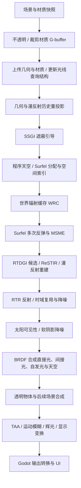

# Kiln 渲染流程

本文描述当前源码的执行流程，也是 Kiln 唯一维护的渲染说明。上游为 Godot
**4.7.2-stable**，提交 `ed1daf0bf001b61586d9930840f2f1394092c079`。

## 管线边界

`kiln_deferred` 是引擎内的 G-buffer 延迟渲染器。高级 GI、反射、软太阳阴影和显示处理
只在 Kiln Pipeline 中执行。Godot 原生 Forward+、Mobile、Compatibility 使用原有路径。
旧的 Forward+ Kiln GI 挂接已移除。

Kiln 复用 Godot 的场景提交、材质光栅化、RenderingDevice、透明物体绘制及输出设施。
共享渲染文件中的新增行为由 Kiln 模式限定，避免把 GI 侵入原生 Forward+ 的着色流程。
实现入口是 [`render_forward_clustered.cpp`](../../servers/rendering/renderer_rd/forward_clustered/render_forward_clustered.cpp)，
GPU 调度集中在 [`kiln_gi.cpp`](../../servers/rendering/renderer_rd/kiln/kiln_gi.cpp)。

## 一帧的执行顺序



### 1. 场景、G-buffer 与光线查询

[`KilnGIWorld`](../../scene/3d/kiln_gi_world.h) 及其
[`场景采集实现`](../../scene/3d/kiln_gi_scene.cpp) 采集原始三角形、材质和实例变换，
通过 `KilnWorld` 快照传递给渲染线程。静态几何、动态几何和材质分别记录版本。
`capture_roots` 限定采集范围；刚体运动实例用 `kiln_dynamic` 元数据声明。

不透明与 alpha cutout 材质一次光栅化写入以下数据，透明物体继续走后续前向阶段：

| 数据 | 用途 |
| --- | --- |
| Albedo / metallic | 漫反射颜色与金属度 |
| Shading normal / perceptual roughness | BRDF、反射采样、历史判断 |
| Emission | 表面自发光 |
| Material response | 材质响应、AO 等原生材质信息 |
| Surface | 实例标识及打包的几何法线 |
| 二维 motion | 屏幕运动数据 |
| 三维 motion | 前一帧物体位置相对当前视图的运动，用于动态重投影 |
| Depth | 反向 Z 深度与位置重建 |

GPU 查询使用原始 float32 顶点建立静态/动态 BLAS 和 TLAS。硬件能力不可用、结构建立
失败或显式选择软件后端时，使用计算 shader 的软件 BVH。BVH 节点按层执行 refit。
动态几何当前仍涉及 CPU 几何/BVH 重建，并非通用 GPU 蒙皮几何更新。

光线命中材质从三角形记录和 UV 页获取，albedo 页为 512×512、sRGB、双线性采样。
光栅材质与光线命中材质的支持范围并不完全相同。

### 2. 重投影与 SSGI

相机 jitter 使用 128 个 Halton 样本，并绑定到该视口的 GI 帧号。几何重投影结合深度、
法线和物体三维 motion，随后重投影上一帧全分辨率漫反射历史。无效历史的速度置零。

`kiln_ssgi*` 在半分辨率计算屏幕空间遮蔽，执行空间过滤、全分辨率上采样和时域过滤。
它为间接光重建提供几何与遮蔽引导，不替代世界空间 GI。

### 3. 天空、Surfel 与 WRC

`kiln_sky` 更新 32×32 的六面程序天空。Surfel 池固定为 **262,144** 个条目，使用
以先前相机位置为锚点的 clipmap 空间索引。

Surfel 阶段依次执行缺失检测、记录分配前的调度边界、老化、分配、清空网格计数、
计数、分段前缀扫描与条目入格。计数/入格使用分配前取整的边界；越过该边界的新条目
下一帧进入索引。每个存活 Surfel 追踪四条余弦分布路径，结合缓存进行多次反弹，
使用 MSME 积累辐照度。

WRC 在 Surfel 当帧追踪之前更新：**192** 个世界探针、八面体辐射图块、视差校正与
八帧积累。它由 `kiln_wrc*` 管理，为 RTDGI 提供远处/次级路径辐射信息。

### 4. RTDGI / ReSTIR 漫反射

半分辨率每个接收点生成一条漫反射候选路径。随后进行路径有效性判断、ReSTIR 时域
候选复用、两轮空间复用、全分辨率 resolve，以及漫反射时域和空间过滤。

候选、命中点、法线、reservoir、历史辐照度及矩分别保存。最终 `diffuse` 是应用主表面
材质响应之前的间接漫反射信号。对应源码为 `kiln_restir*` 和 `kiln_rtdgi*`。

### 5. RTR 反射与太阳阴影

`kiln_rtr*` 在半分辨率生成 GGX VNDF 反射候选，使用蓝噪声序列、时域 ReSTIR、
全分辨率 resolve、时域过滤及空间清理。反射信号在过滤期间脱离主材质响应，合成时
再乘回预积分反射项。

`kiln_shadow*` 采样太阳圆盘可见性，经过阴影位打包、时域积累和三轮空间过滤，
产生软阴影可见性。太阳视直径为 0.53°。

### 6. 光照与显示

`kiln_light` 使用分层 BRDF 和 64×64 预积分 LUT，把太阳直接光、软阴影、表面自发光、
间接漫反射和反射合成为 HDR 场景辐射 `rtdgi_lighting`，并处理天空和太阳盘。
原生全屏 resolve 负责接入该结果或显示材质调试通道。

后续透明物体与场景合成完成后，`process_display()` 执行历史重投影、输入/历史过滤、
输入概率估计与过滤、TAA、速度分块归约和扩张、运动模糊、多层辉光、显示变换、锐化、
暗角及抖动。结果交给 Godot 输出转换，避免重复曝光和 tone mapping。

## 资源生命周期与保留代码

每个视口拥有独立的 `KilnGI::View`。屏幕纹理随视口重新配置而重建；世界缓存、材质页
和光线查询结构单独管理。环境切换销毁该视口的缓存。显式 `reset_history()` 与静态
几何改变触发重新积累。动态实例或光照变化沿正常逐帧路径更新。

当前运行管线有 **55 个计算阶段**。旧 SurfelPlus 调度、XeGTAO、旧独立反射实现、
它们的纹理/缓存、射线预算选项和 Surfel 磁盘调试视图已移除。

**NRD 代码保留，但当前管线没有 NRD 开关，也不会创建或调用 NRD 实例。**
`kiln_nrd.cpp/.h` 保留 SDK 适配器；`nrd/sources/` 保留其原参数布局及配套 shader 依赖。
该目录不进入当前 GI 的 shader 阶段列表。`prepare_nrd.py` 和原有 SCons SDK 选项保留，
Windows SDK 固定为 NRD 4.17.3（`792eff196afdd350fd9c3f862119017ccb438a0e`）。
SDK 不随引擎源码分发。Shader 可编译不等于 NRD 已接入或完成画面验证。

## 构建、运行与检查

以下命令在仓库根目录运行。Windows 构建参数与本机验证一致：

```powershell
python kiln/tools/build_gi_shaders.py
python kiln/tools/check_gi_shaders.py --include-nrd --output G:/KilnTemp/shaders
python -m SCons platform=windows target=editor module_mono_enabled=yes production=no accesskit=no d3d12=no -j16
python -m SCons platform=windows target=template_release module_mono_enabled=yes production=no accesskit=no d3d12=no -j16
```

普通引擎构建使用已保存的 GLSL，不要求 DXC 或外部参考仓库。修改保留的 HLSL 或
适配器时，先运行 `python kiln/tools/build_reference_shaders.py`；该步骤需要 Vulkan SDK
的 DXC 与 SPIRV-Cross，再生成聚合 shader 并执行检查。`check_gi_shaders.py` 校验阶段
注册顺序并编译软件、硬件查询变体；`--include-nrd` 额外检查独立保留的 NRD shader。

### Cornell

```powershell
python kiln/tools/fetch_cornell.py
bin/godot.windows.editor.x86_64.mono.console.exe --headless --editor --path kiln/cornell --import
bin/godot.windows.editor.x86_64.mono.console.exe --path kiln/cornell --rendering-method kiln_deferred
```

准备工具只从相邻的 `../kajiya` 读取六个白名单文件，并按 `ASSETS.sha256` 校验。
它按参考加载约定烘焙静态场景，保留所有三角形、禁用有损网格压缩/LOD；准备完成后
Cornell 独立运行。默认带车，原始资源与生成的 `assets/prepared` 分开保存。

确定性诊断支持 `--frames=128 --size=960x540 --output=<临时目录>`，以及
`--timeline=static|camera|relight|object|combined` 和 `--query-backend=1`（软件 BVH）。
中间信号通过 `request_capture()` 读回，不能把开启读回的耗时当成性能测量。

`compare_kajiya.py` 保留为外部参考对照工具；其名称和参考仓库名称属于来源标识。
参考查看器需在固定提交上应用 `kajiya_capture.patch` 并构建 `cargo build --release -p view`。
工具使用独立运行目录，不覆盖参考查看器的用户状态。

```powershell
python kiln/tools/compare_kajiya.py --frames 32,128,256 --size 960x540 --cameras front,left,right --reference-repeats 3 --output G:/KilnTemp/cornell-comparison
```

两个引擎必须使用相同网格、相机、太阳、分辨率、帧数和 HDR 平均窗口；不做曝光拟合。
`prepare_canonical_cornell.py` 生成的去重网格仅用于独立诊断，不能代替原输入结果。
发布模板需使用 `Windows Cornell validation` 预设导出到临时目录，再运行导出程序；
裸 release template 不接受普通项目路径覆盖。

### Sponza 与其他示例

`fetch_sponza.py` 准备 Sponza 后，可用 `kiln/sponza/run.ps1` 启动；`-ForwardPlus`
选择原生 Forward+。Sponza 保留粗糙度、时间、GI 开关和当前 G-buffer/间接光诊断。
F4/F5 切换有效视图，F6 重置历史。`kiln/demo` 是独立岛屿/局部灯测试场景。
这些示例中的局部灯和材质压力测试不意味着当前高级 GI 支持所有相关效果。

## 验证范围

- **已实现：** 上述 G-buffer、软件/硬件查询调度、Surfel、WRC、RTDGI/ReSTIR、RTR、
  SSGI、太阳软阴影与时域显示流程。
- **已编译：** 本次清理后的 Windows x86_64 Mono editor 和 template_release，均为
  `production=no`。Cornell 发布包成功导出，并在真实 GPU 上运行。
  64 个 shader 变体通过 SPIR-V 检查，其中 3 个属于保留的 NRD 适配代码。
- **实际 GPU：** RTX 5070 Ti / Vulkan 1.4.341 下验证 Cornell 静态、961×541 相机/光照/物体
  联动、640×360 软件 BVH、导出的发布包，以及 Sponza 静态和反射诊断视图。Forward+、
  Mobile（Vulkan）与 Compatibility（OpenGL）也完成原生路径窗口渲染。以上九项均退出成功、
  无错误日志，输出截图已检查。Headless 仅用于导入/导出。
- **未建立支持或未验证：** 当前高级 GI 的三角形灯 NEE、完整局部解析灯光传输、全材质
  光线命中一致性、通用蒙皮与多视图、透明/后期的完整参考一致性、时域升采样与 HDR 显示。
  本次没有 macOS/Metal、Linux、移动平台或 D3D12 构建及视觉验证，也没有重新测量性能。

清理保留现有采样与显示算法。GPU 原子分配与缓存更新存在执行顺序差异，逐像素完全一致
不能作为跨运行保证。旧中间报告中的性能和其他平台结论不转移到这次构建。

2026-09-19 的清理前后 Cornell 第 128 帧对照未发现可见回归；显示 RGB RMSE 为 0.00357
（0–1 范围），表面 HDR 相对 RMSE 为 1.97%，HDR 数据有限。这是单帧回归对照，包含随机
缓存差异，不是重新进行跨引擎一致性验收。55 个计算源码的再生成结果一致，74 份保留
源码与 30 项手工端口的来源哈希已校验。构建日志、原始截图、数值结果与清理前快照位于
`G:/KilnTemp/cleanup-2026-09-19`，不放入源码树。

## 来源与许可证

运行代码使用 Kiln 命名；作者、许可证、原始源码路径和参考工具中的 Kajiya 名称保留。
Kajiya 算法固定在 `da853891736a9e1b294be0e3d64ec73b1b0030dd`。
保留 HLSL、手工端口映射及哈希位于
[`sources/reference/provenance.json`](../../servers/rendering/renderer_rd/kiln/sources/reference/provenance.json)。
Kajiya MIT、AMD 阴影过滤、Felix Westin 天空、Oklab、蓝噪声及保留 NRD 依赖的许可证见
[`licenses/`](../../servers/rendering/renderer_rd/kiln/licenses) 和引擎 `COPYRIGHT.txt`。

历史导入的必要来源信息保留在 [`kiln/provenance`](../provenance)。源游戏代码是只读参考；
不会复制秘密配置、存档或缓存。示例资源有独立于引擎的再分发条款：Cornell 中的
“336 LRM” 由 RustShake 制作，源地址为 `https://skfb.ly/6Snq9`，随附许可证为
**CC BY-NC 4.0**；Cornell box 的随附通知署名原作者并指向原始数据页，不能据此推定
广泛再分发授权。原始通知及哈希保留。仓库不发布这些资源载荷，发布前需核实其授权。
