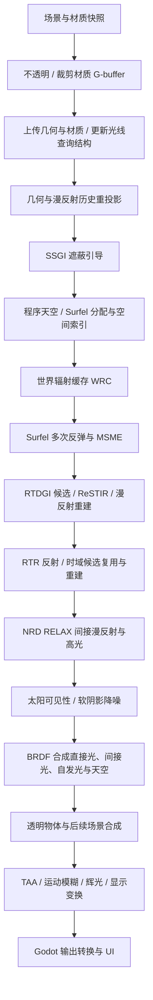

# Kiln 渲染流程

本文描述当前源码的执行流程，也是 Kiln 唯一维护的渲染说明。上游为 Godot
**4.7.2-stable**，提交 `ed1daf0bf001b61586d9930840f2f1394092c079`。

## 管线边界

`kiln_deferred` 是引擎内的 G-buffer 延迟渲染器。高级 GI、反射、软太阳阴影和显示处理
只在 Kiln Pipeline 中执行。Godot 原生 Forward+、Mobile、Compatibility 使用原有路径。
旧的 Forward+ Kiln GI 挂接已移除。

Kiln 复用 Godot 的场景提交、材质光栅化、RenderingDevice、透明物体绘制及输出设施。
共享渲染文件中的新增行为由 Kiln 模式限定，避免把 GI 侵入原生 Forward+ 的着色流程。
实现入口是 [`render_forward_clustered.cpp`](../../servers/rendering/renderer_rd/forward_clustered/render_forward_clustered.cpp)，
GPU 调度集中在 [`kiln_gi.cpp`](../../servers/rendering/renderer_rd/kiln/kiln_gi.cpp)。

## 一帧的执行顺序



### 1. 场景、G-buffer 与光线查询

[`KilnGIWorld`](../../scene/3d/kiln_gi_world.h) 及其
[`场景采集实现`](../../scene/3d/kiln_gi_scene.cpp) 采集原始三角形、材质和实例变换，
通过 `KilnWorld` 快照传递给渲染线程。静态几何、动态几何和材质分别记录版本。
`capture_roots` 限定采集范围；刚体运动实例用 `kiln_dynamic` 元数据声明。

不透明与 alpha cutout 材质一次光栅化写入以下数据，透明物体继续走后续前向阶段：

| 数据 | 用途 |
| --- | --- |
| Albedo / metallic | 漫反射颜色与金属度 |
| Shading normal / perceptual roughness | BRDF、反射采样、历史判断 |
| Emission | 表面自发光 |
| Material response | 材质响应、AO 等原生材质信息 |
| Surface | 实例标识及打包的几何法线 |
| 二维 motion | 屏幕运动数据 |
| 三维 motion | 前一帧物体位置相对当前视图的运动，用于动态重投影 |
| Depth | 反向 Z 深度与位置重建 |

GPU 查询使用原始 float32 顶点建立静态/动态 BLAS 和 TLAS。硬件能力不可用、结构建立
失败或显式选择软件后端时，使用计算 shader 的软件 BVH。BVH 节点按层执行 refit。
动态几何当前仍涉及 CPU 几何/BVH 重建，并非通用 GPU 蒙皮几何更新。

光线命中材质从三角形记录和 UV 页获取，albedo 页为 512×512、sRGB、双线性采样。
光栅材质与光线命中材质的支持范围并不完全相同。

### 2. 重投影与 SSGI

相机 jitter 使用 128 个 Halton 样本，并绑定到该视口的 GI 帧号。几何重投影结合深度、
法线和物体三维 motion，随后重投影上一帧全分辨率 NRD 漫反射输出，供次级路径反馈。
反馈只接受几何验证通过的双线性邻点；不把 NRD alpha 中的方差当作历史长度。
无效历史的速度置零，次级路径改用世界缓存。

`kiln_ssgi*` 在半分辨率计算屏幕空间遮蔽，执行空间过滤、全分辨率上采样和时域过滤。
它为间接光重建提供几何与遮蔽引导，不替代世界空间 GI。

### 3. 天空、Surfel 与 WRC

`kiln_sky` 更新 32×32 的六面程序天空。Surfel 池固定为 **262,144** 个条目，使用
以先前相机位置为锚点的 clipmap 空间索引。

Surfel 阶段依次执行缺失检测、记录分配前的调度边界、老化、分配、清空网格计数、
计数、分段前缀扫描与条目入格。计数/入格使用分配前取整的边界；越过该边界的新条目
下一帧进入索引。每个存活 Surfel 追踪四条余弦分布路径，结合缓存进行多次反弹，
使用 MSME 积累辐照度。

WRC 在 Surfel 当帧追踪之前更新：**192** 个世界探针、八面体辐射图块、视差校正与
八帧积累。它由 `kiln_wrc*` 管理，为 RTDGI 提供远处/次级路径辐射信息。

### 4. RTDGI / ReSTIR 漫反射

半分辨率每个接收点生成一条漫反射候选路径。随后进行路径有效性判断、ReSTIR 时域
候选复用、两轮空间复用及全分辨率 resolve，随后与反射一起交给 NRD 降噪。

候选、命中点、法线和 reservoir 分别保存。旧漫反射滤波的历史辐照度与矩仅在回退时分配。
最终 `diffuse` 是应用主表面
材质响应之前的间接漫反射信号。对应源码为 `kiln_restir*` 和 `kiln_rtdgi*`。

### 5. RTR 反射与太阳阴影

`kiln_rtr*` 在半分辨率生成 GGX VNDF 反射候选，使用蓝噪声序列、时域 ReSTIR、
全分辨率 resolve，再由 NRD 完成降噪。反射命中采样使用当帧 RTDGI resolve 信号，
由合并式 NRD 处理最终两路间接光。反射信号在过滤期间脱离主材质响应，合成时
再乘回预积分反射项。

`kiln_shadow*` 采样太阳圆盘可见性，经过阴影位打包、时域积累和三轮空间过滤，
产生软阴影可见性。太阳视直径为 0.53°。

### 6. 光照与显示

`kiln_light` 使用分层 BRDF 和 64×64 预积分 LUT，把太阳直接光、软阴影、表面自发光、
间接漫反射和反射合成为 HDR 场景辐射 `rtdgi_lighting`，并处理天空和太阳盘。
原生全屏 resolve 负责接入该结果或显示材质调试通道。

后续透明物体与场景合成完成后，`process_display()` 执行历史重投影、输入/历史过滤、
输入概率估计与过滤、TAA、速度分块归约和扩张、运动模糊、多层辉光、显示变换、锐化、
暗角及抖动。结果交给 Godot 输出转换，避免重复曝光和 tone mapping。

## 资源生命周期与保留代码

每个视口拥有独立的 `KilnGI::View`。屏幕纹理随视口重新配置而重建；世界缓存、材质页
和光线查询结构单独管理。环境切换销毁该视口的缓存。显式 `reset_history()` 与静态
几何改变触发重新积累。动态实例或光照变化沿正常逐帧路径更新。

当前注册 **57 个 Kiln 计算阶段**，另由 NRD SDK 调度 RELAX 内部阶段。旧 SurfelPlus 调度、XeGTAO、旧独立反射实现、
它们的纹理/缓存、射线预算选项和 Surfel 磁盘调试视图已移除。

### NRD：始终开启的间接光降噪

带 SDK 的 Windows Vulkan 构建为每个视口创建一个 **NRD 4.17.3
RELAX_DIFFUSE_SPECULAR** 实例，始终运行，没有场景或项目开关。固定 SDK 提交为
`792eff196afdd350fd9c3f862119017ccb438a0e`。未包含 SDK、非 Vulkan 或初始化/调度失败时
明确警告并回退到原滤波器；`get_statistics().nrd_active` 报告实际运行状态。

`kiln_nrd_prepare` 使用 G-buffer 生成世界空间法线、NRD 的旋转八面体法线/粗糙度编码、
线性视图深度，以及不包含相机移动和 jitter 的三维物体运动。相机矩阵和每视口前帧
jitter 单独传入。视口大小变化重建实例并清空历史；环境、静态几何或显式历史重置也
重新积累。

输入是全分辨率 RTDGI/RTR resolve 的去材质信号。RELAX 采用按实际渲染帧率换算的历史：
漫反射最长 1 秒、高光最长 0.5 秒，均限于 SDK 的 255 帧上限；fast history 为各自主历史
的五分之一。60 Hz 下分别为 60/12 和 30/6 帧。低帧率同步缩短重建历史，保留内置
antilag、5 轮 A-trous 和 anti-firefly。漫反射不提供虚构命中距离，关闭其 hit-distance prepass 与
reconstruction；反射使用 RTR 单独保存的真实光线长度，不能把 radiance alpha 中的
方差当成命中距离。NRD 输出直接进入原 BRDF 合成，保持材质重新调制规则；反射时域重建的负值下冲
在合成前截为零，避免负辐射扣暗画面。
NRD 正常运行时，原 RTDGI temporal/spatial 和 RTR filter/cleanup 均不调度；上一帧
NRD 漫反射通过 `kiln_nrd_reproject` 提供反馈。旧滤波历史与中间纹理按需分配，正常路径
少用 48 字节/像素：1080p 约 94.9 MiB，1440p 约 168.8 MiB（纹理逻辑数据量，
不含驱动对齐与内存池）。统计提供 `nrd_feedback`、`legacy_diffuse_filter_active` 和
`legacy_filter_texture_bytes`，可检查实际路径。

ReSTIR 的时域/空间候选复用、Surfel/WRC 积累、SSGI 与阴影各自的过滤，以及最终 TAA
继续保留：它们分别负责路径采样、世界缓存、其他信号和抗锯齿，不是两路间接光的重复降噪。

[`kiln_nrd.cpp`](../../servers/rendering/renderer_rd/kiln/kiln_nrd.cpp) 负责 SDK 调度；
旧 `nrd/sources/` 仅保留历史适配 shader，不进入当前阶段列表。SDK 不随引擎源码分发，
缺失时先运行 `python kiln/tools/prepare_nrd.py`。NRD 是跨厂商计算 shader，但本次只验证
下文所列 GPU，不能据此声称其他 GPU/平台已通过。

## 构建、运行与检查

以下命令在仓库根目录运行。Windows 构建参数与本机验证一致：

```powershell
python kiln/tools/build_gi_shaders.py
python kiln/tools/check_gi_shaders.py --include-nrd --output G:/KilnTemp/shaders
python -m SCons platform=windows target=editor module_mono_enabled=yes production=no accesskit=no d3d12=no -j16
python -m SCons platform=windows target=template_release module_mono_enabled=yes production=no accesskit=no d3d12=no -j16
```

普通引擎构建使用已保存的 GLSL，不要求 DXC 或外部参考仓库。修改保留的 HLSL 端口时，先运行 `python kiln/tools/build_reference_shaders.py`；该步骤需要 Vulkan SDK
的 DXC 与 SPIRV-Cross，再生成聚合 shader 并执行检查。`check_gi_shaders.py` 校验阶段
注册顺序并编译软件、硬件查询变体；`--include-nrd` 额外检查独立保留的 NRD shader。

### Cornell

```powershell
python kiln/tools/fetch_cornell.py
bin/godot.windows.editor.x86_64.mono.console.exe --headless --editor --path kiln/cornell --import
bin/godot.windows.editor.x86_64.mono.console.exe --path kiln/cornell --rendering-method kiln_deferred
```

准备工具只从相邻的 `../kajiya` 读取六个白名单文件，并按 `ASSETS.sha256` 校验。
它按参考加载约定烘焙静态场景，保留所有三角形、禁用有损网格压缩/LOD；准备完成后
Cornell 独立运行。默认带车，原始资源与生成的 `assets/prepared` 分开保存。

确定性诊断支持 `--frames=128 --size=960x540 --output=<临时目录>`，以及
`--timeline=static|camera|relight|object|combined` 和 `--query-backend=1`（软件 BVH）。
中间信号通过 `request_capture()` 读回，不能把开启读回的耗时当成性能测量。
`--capture-indirect-only` 仅保存间接漫反射、高光、HDR 合成与 surface，便于长序列诊断。
`--benchmark --frames=768 --size=1920x1080 --output=<临时目录>` 跳过全部图像读回，
预热 256 帧后保存 512 帧 GPU 时间戳到 `profile.json`；引擎参数 `--fixed-fps 60`
固定模拟步长。时间戳是帧内累计值，阶段耗时需要相邻项相减。

`compare_kajiya.py` 保留为外部参考对照工具；其名称和参考仓库名称属于来源标识。
参考查看器需在固定提交上应用 `kajiya_capture.patch` 并构建 `cargo build --release -p view`。
工具使用独立运行目录，不覆盖参考查看器的用户状态。

```powershell
python kiln/tools/compare_kajiya.py --frames 32,128,256 --size 960x540 --cameras front,left,right --reference-repeats 3 --output G:/KilnTemp/cornell-comparison
```

两个引擎必须使用相同网格、相机、太阳、分辨率、帧数和 HDR 平均窗口；不做曝光拟合。
`prepare_canonical_cornell.py` 生成的去重网格仅用于独立诊断，不能代替原输入结果。
发布模板需使用 `Windows Cornell validation` 预设导出到临时目录，再运行导出程序；
裸 release template 不接受普通项目路径覆盖。

### Sponza 与其他示例

`fetch_sponza.py` 准备 Sponza 后，可用 `kiln/sponza/run.ps1` 启动；`-ForwardPlus`
选择原生 Forward+。Sponza 保留粗糙度、时间、GI 开关和当前 G-buffer/间接光诊断。
F4/F5 切换有效视图，F6 重置历史。`kiln/demo` 是独立岛屿/局部灯测试场景。
这些示例中的局部灯和材质压力测试不意味着当前高级 GI 支持所有相关效果。

## 历史清理验证范围（NRD 接入前）

- **已实现：** 上述 G-buffer、软件/硬件查询调度、Surfel、WRC、RTDGI/ReSTIR、RTR、
  SSGI、太阳软阴影与时域显示流程。
- **已编译：** 本次清理后的 Windows x86_64 Mono editor 和 template_release，均为
  `production=no`。Cornell 发布包成功导出，并在真实 GPU 上运行。
  64 个 shader 变体通过 SPIR-V 检查，其中 3 个属于保留的 NRD 适配代码。
- **实际 GPU：** RTX 5070 Ti / Vulkan 1.4.341 下验证 Cornell 静态、961×541 相机/光照/物体
  联动、640×360 软件 BVH、导出的发布包，以及 Sponza 静态和反射诊断视图。Forward+、
  Mobile（Vulkan）与 Compatibility（OpenGL）也完成原生路径窗口渲染。以上九项均退出成功、
  无错误日志，输出截图已检查。Headless 仅用于导入/导出。
- **未建立支持或未验证：** 当前高级 GI 的三角形灯 NEE、完整局部解析灯光传输、全材质
  光线命中一致性、通用蒙皮与多视图、透明/后期的完整参考一致性、时域升采样与 HDR 显示。
  本次没有 macOS/Metal、Linux、移动平台或 D3D12 构建及视觉验证，也没有重新测量性能。

清理保留现有采样与显示算法。GPU 原子分配与缓存更新存在执行顺序差异，逐像素完全一致
不能作为跨运行保证。旧中间报告中的性能和其他平台结论不转移到这次构建。

2026-09-19 的清理前后 Cornell 第 128 帧对照未发现可见回归；显示 RGB RMSE 为 0.00357
（0–1 范围），表面 HDR 相对 RMSE 为 1.97%，HDR 数据有限。这是单帧回归对照，包含随机
缓存差异，不是重新进行跨引擎一致性验收。55 个计算源码的再生成结果一致，74 份保留
源码与 30 项手工端口的来源哈希已校验。构建日志、原始截图、数值结果与清理前快照位于
`G:/KilnTemp/cleanup-2026-09-19`，不放入源码树。

## NRD 初次接入验证（2026-09-19，重构前）

- **已实现：** SDK 可用的 Vulkan Kiln 视口始终运行 RELAX_DIFFUSE_SPECULAR；世界空间运动、
  法线/粗糙度、线性深度、反射命中距离适配；分辨率变化与历史重置；实际状态统计及 GPU 时间戳。
- **已编译：** Windows x86_64 Mono editor 与 template_release（`production=no`）；
  65 个 shader 变体通过 glslang 与 SPIR-V validation，其中 3 个是保留的历史适配 shader。
- **实际 GPU：** RTX 5070 Ti / Vulkan 1.4.341。Cornell 使用原始带车模型，固定模拟 60 Hz；
  静态诊断 960×540、256 帧，比较最后 64 帧的独立间接光信号。相机、光照、物体及
  联动时间线各检查 64 帧序列，涵盖 961×541 非整组尺寸；间接光与合成 HDR 均无非有限值。
  软件 BVH 640×360、显式历史重置、运行时 resize、相机切换后重置，以及导出发布包均完成
  GPU 窗口渲染并检查截图；有效运行日志无错误。
- **未验证：** 其他 GPU、macOS/Metal、Linux、移动平台、D3D12；此处性能不外推到这些平台。

静态间接漫反射相邻帧 RGB RMS：墙面 `0.03383 → 0.00658`（降低 80.6%），
顶面 `0.02016 → 0.00491`（75.7%），地面 `0.03010 → 0.00354`（88.3%）。
间接高光：墙面 `0.01692 → 0.00181`（89.3%），顶面 `0.02394 → 0.00351`（85.3%），
地面 `0.02226 → 0.00566`（74.6%），车身区域 `0.30704 → 0.17575`（42.8%）。
这是固定图像区域的帧间波动指标，包含 jitter 在几何边缘产生的变化，不能解释成路径追踪
真值误差。NRD 没有消除所有噪声；车身最终合成的直接高光/子像素闪烁仍存在，独立于本次
处理的两路间接光。

性能使用独立无读回运行：每个版本、每种分辨率交替运行 3 次，每次预热 256 帧、统计
512 帧（共 1536 帧/配置）；相同场景、采样、分辨率、固定 60 Hz 模拟和关闭 VSync。
表中是 GPU 渲染时间均值，不包含 CPU 等待、窗口呈现和诊断读回。

| 分辨率 | 原管线 | NRD 管线 | 整帧净增加 | NRD + 输入转换本身 |
| --- | ---: | ---: | ---: | ---: |
| 960×540 | 1.302 ms | 1.470 ms | **0.168 ms** | 0.216 ms |
| 1920×1080 | 3.107 ms | 3.727 ms | **0.620 ms** | 0.708 ms |
| 2560×1440 | 5.311 ms | 6.261 ms | **0.950 ms** | 1.272 ms |

净增加小于 NRD 自身，因为省去旧反射 temporal/cleanup；也包含缓存、调度及跨运行波动。
1080p 三次独立运行均值：原版 3.114/3.108/3.099 ms，NRD 3.729/3.714/3.738 ms。
加入反射负值截断后的最终二进制额外复测 1080p，512 帧均值为 3.654 ms；
三轮对照用于给出约 0.6 ms 的预算，单轮时钟/调度波动不当作进一步优化收益。
原始时间戳、截图、信号、分析脚本和 JSON 位于 `G:/KilnTemp/nrd-2026-09-19`。
有效静态序列为 `baseline-fixed-static` 与 `nrd-verified-static`；动态序列用
`nrd-verified-*` 命名。

## NRD 滤波与反馈重构验证（2026-09-19，平滑调参前）

- **已实现：** 正常 NRD 路径移除旧漫反射 temporal/spatial 调度，改用经过几何验证的
  NRD 输出作为次级路径反馈；反射命中读取当帧原始漫反射 resolve；旧滤波纹理仅在回退时分配。
- **已编译：** Windows x86_64 Mono editor、template_release，以及 `kiln_nrd=no` editor；
  66 个 shader 变体通过编译与 SPIR-V validation（57 个注册阶段、6 个硬件查询变体、
  3 个保留 NRD 适配 shader）。
- **实际 GPU：** RTX 5070 Ti / Vulkan 1.4.341。比较保留旧滤波、合并 NRD、拆分两次
  NRD 三种版本；静态 640×360 最后 32 帧，相机、光照、联动序列最后 16 帧，包含
  641×361 非整组尺寸。最终构建另验证显式重置、相机切换、运行时 resize 至 961×541、
  软件 BVH、无 SDK 回退和实际导出包；两路间接光与合成 HDR 数据有限，截图完成检查。
  NRD 路径统计旧滤波纹理为 0 字节；321×181 回退路径为 2,788,848 字节。
- **未验证：** 其他 GPU/平台、长时间复杂场景及 NRD 调度失败的故障注入。本次结论限定于
  Cornell 场景，不代表所有光照变化或反射材质都已无闪烁。

静态帧间波动与重构前 NRD 接近：漫反射墙面 RMS `0.00751 → 0.00741`、地面
`0.00463 → 0.00426`；反射地面 `0.00789 → 0.00765`、车身 `0.16579 → 0.16452`。
静态合成 HDR 均值变化约 -0.31%，对旧版的相对 RMS 差异约 0.99%；动态时间线约
0.95%–2.14%。这些是回归差异与帧间波动，不是对路径追踪真值的准确率。

太阳突然关闭的 320×180 测试中，墙面漫反射达到最终变化量 90%（连续四个采样保持在
阈值内）由约 40 帧变成 44 帧；固定 60 Hz 下多约 67 ms。这是反馈滤波变化的可测代价，
尚未消除。没有直接把当前帧路径无效性图接入 NRD 历史置信度：SDK 要求该输入位于
上一帧坐标，且需要区分随机波动与光照变化。

拆为 `RELAX_DIFFUSE` 和 `RELAX_SPECULAR` 两次调度没有明显画质收益；第一轮三次测量
在 1080p 比合并方案慢约 0.32 ms，1440p 慢约 0.50 ms，因此保留合并式 NRD。

关闭其他测试窗口后，对**重构后、平滑调参前的二进制**、重构前 NRD、未接 NRD 的原始基线重新交替
运行三轮。每轮预热 256 帧后记录 512 帧 GPU 时间戳，固定模拟 60 Hz、相同采样与
场景、关闭 VSync，无读回。均值如下：

| 分辨率 | 未接 NRD | 重构前 NRD | 最终 NRD | 对未接 NRD 净增加 | 本次重构节省 |
| --- | ---: | ---: | ---: | ---: | ---: |
| 1920×1080 | 3.075 ms | 3.648 ms | 3.440 ms | **0.365 ms** | **0.208 ms** |
| 2560×1440 | 5.330 ms | 6.323 ms | 5.853 ms | **0.522 ms** | **0.471 ms** |

最终 NRD 与输入转换本身为 0.702 / 1.250 ms，净增加已扣除旧过滤开销并包含调度、
缓存与测量波动。最终版三轮均值分别为 3.446/3.436/3.438 ms 和
5.840/5.846/5.871 ms；GPU 渲染时间不包含 CPU 等待及窗口呈现。

实验二进制、脚本、截图、逐帧信号与时间戳保存在
`C:/Users/Administrator/AppData/Local/Temp/kiln-nrd-refactor-20260919`。
该轮统计为 `verified-performance.json`；
`performance.json` 为先前的三方案实验，不能与最终配对结果混用。

## 静止漫反射游动验证（2026-09-19）

固定相机、太阳和物体后仍可观测到漫反射的慢速明暗变化。ReSTIR 复用带来相关噪声，
但输入不一致及积累参数也会影响结果；不能把全部波动归为算法无法改善的限制。

- **输入修正：** `kiln_restir_trace` 的光线起点改用 `restir_hi()`，与法线、reservoir
  复用和 resolve 的四相子像素轮换一致。原先固定左上角起点可能在边界上混用不同表面的
  起点和法线。该修正单独测试过，并非消除慢速游动的充分条件。
- **平滑参数：** 漫反射由固定 30 帧改为上述最长 1 秒的主历史与五分之一 fast history；
  高光保持 0.5 秒预算并按实际帧率换算。固定 30 帧在高帧率下覆盖的时间过短。
  更大的 luminance phi 与第六轮 A-trous 在 Cornell 没有明显收益，已弃用。
- **长静态 GPU 测试：** Cornell 与 Sponza，640×360，固定 60 Hz；先预热 1024 帧，
  再观察 512 帧，每 8 帧保存一组原始漫反射、NRD 漫反射和合成 HDR，共 64 组。
  驱动脚本断言相机及太阳变换不变；Sponza 同时关闭日夜和物体动画。

以亮度图进行 sigma=4 像素的空间高斯低通后，计算各像素的时间标准差再取 RMS，
专门衡量慢速斑块波动，避免只统计相邻帧细噪声。相对调参前已重构 NRD 的结果：

| 区域 | 调参前 | 调参后 | 波动减少 |
| --- | ---: | ---: | ---: |
| Cornell 墙面 | 0.006754 | 0.004660 | 31.0% |
| Cornell 顶面 | 0.005171 | 0.003936 | 23.9% |
| Cornell 地面 | 0.005725 | 0.004791 | 16.3% |
| Sponza 中央区域 | 0.002730 | 0.001807 | 33.8% |

这不是无偏真值误差，也不表示波动已为零。Cornell 墙面平均辐照度变化约 -0.27%，
Sponza 区域约 +0.12%。太阳关闭测试达到 90% 变化量约需 47 帧，相比调参前 44 帧
多约 50 ms（60 Hz）；相比保留旧滤波的 40 帧多约 117 ms。

**已编译** Windows Mono editor/template_release，66 个 shader 变体通过检查；
**实际 GPU 验证**仍为 RTX 5070 Ti / Vulkan。相机、光照及物体联动以 120 Hz、641×361
测试，检查末尾 8 帧，两路间接光与 HDR 均有限并检查截图。最终构建再次验证历史重置、
相机切换、运行时 resize、软件 BVH 和导出包；导出包静态连续 16 帧有效。其他 GPU/平台未验证。

最终平滑版再次与调参前重构版及无 NRD 基线交替测量三轮，每轮预热 256 帧、记录
512 帧 GPU 时间戳，固定 60 Hz，无诊断读回：

| 分辨率 | 无 NRD 基线 | 调参前重构版 | 最终平滑版 | 相对无 NRD 净增加 |
| --- | ---: | ---: | ---: | ---: |
| 1920×1080 | 3.086 ms | 3.444 ms | 3.441 ms | **0.355 ms** |
| 2560×1440 | 5.311 ms | 5.842 ms | 5.817 ms | **0.506 ms** |

平滑调参没有增加空间 dispatch，和调参前的差值在约 0.004/0.025 ms 内，不作为性能
优化收益。最终版三轮分别为 3.440/3.441/3.441 ms 和 5.821/5.811/5.819 ms。
原始结果为 `smooth-performance.json`；前节数据保留为重构实验记录。

数据位于上节的临时目录及 `G:/KilnTemp/nrd-static-20260919`；`final-long-*` 是调参前，
`subpixel-long-*` 为仅修正起点，`spatial-long-*` 为弃用的空间参数，`temporal-long-*`
为最终时间参数。部分中间信号归档于各目录的 `signals.zip`，指标和截图保留。

参数依据参见 [NRD 固定版本设置说明](https://github.com/NVIDIA-RTX/NRD/blob/792eff196afdd350fd9c3f862119017ccb438a0e/Include/NRDSettings.h)
及 [官方采样与残余波动说明](https://github.com/NVIDIA-RTX/NRD#interaction-with-low-discrepancy-samplers-blue-noise)。

## 来源与许可证

运行代码使用 Kiln 命名；作者、许可证、原始源码路径和参考工具中的 Kajiya 名称保留。
Kajiya 算法固定在 `da853891736a9e1b294be0e3d64ec73b1b0030dd`。
保留 HLSL、手工端口映射及哈希位于
[`sources/reference/provenance.json`](../../servers/rendering/renderer_rd/kiln/sources/reference/provenance.json)。
Kajiya MIT、AMD 阴影过滤、Felix Westin 天空、Oklab、蓝噪声及保留 NRD 依赖的许可证见
[`licenses/`](../../servers/rendering/renderer_rd/kiln/licenses) 和引擎 `COPYRIGHT.txt`。

历史导入的必要来源信息保留在 [`kiln/provenance`](../provenance)。源游戏代码是只读参考；
不会复制秘密配置、存档或缓存。示例资源有独立于引擎的再分发条款：Cornell 中的
“336 LRM” 由 RustShake 制作，源地址为 `https://skfb.ly/6Snq9`，随附许可证为
**CC BY-NC 4.0**；Cornell box 的随附通知署名原作者并指向原始数据页，不能据此推定
广泛再分发授权。原始通知及哈希保留。仓库不发布这些资源载荷，发布前需核实其授权。
