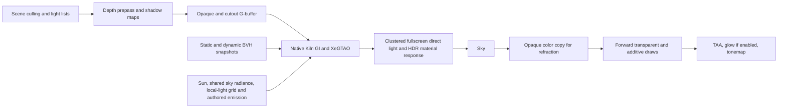

# Kiln renderer architecture and contract

Fixed upstream: Godot 4.7.2-stable, `ed1daf0bf001b61586d9930840f2f1394092c079`.
The `kiln_deferred` selector constructs the clustered renderer with a distinct
opaque pass. It preserves upstream culling, cluster construction, shadow maps,
sky, alpha sorting, exposure, TAA and tonemapping. It does not run the ordinary
Forward+ opaque color draw. The Forward+ selector remains separately runnable.

For Forward+ comparisons, the same native GI runs after its depth/normal prepass,
before its opaque color pass. `kiln_surface` evaluates the same authored direct
BRDF and native indirect response in both renderers. Shader scripts supply
reflectance and genuine emission; they do not inject already-lit GI into EMISSION.

## G-buffer

| Attachment | Format | Meaning | Bytes/pixel |
| --- | --- | --- | ---: |
| 0 | RGBA8 UNORM | Linear albedo RGB, metallic A | 4 |
| 1 | RGBA16F | Signed view normal XYZ, perceptual roughness W | 8 |
| 2 | RGBA16F | Authored, unexposed emission RGB | 8 |
| 3 | RGBA8 UNORM | Specular, AO, AO direct influence, scalar leaf backlight | 4 |
| 4 | R32UI | Instance index + 1; high bit selects Kiln BRDF | 4 |
| 5 | RG16F | Previous minus current unjittered screen UV | 4 |
| Depth | Engine depth format | Reverse-Z | typically 4 |

Six color attachments, 32 bytes/pixel before depth, approximately 63.3 MiB at
1080p. This is allocation/pixel payload, not a measured bandwidth figure; shading,
shadow maps, GI histories and post processing require additional storage/traffic.
Albedo and scalar packing have 8-bit quantization. Normals and emission use half
floats. Material A reserves 1 for unshaded; supported thin-leaf transmission is
scalar and clamped below .5. Textures, vertex attributes, normal maps and alpha
scissor are evaluated by the engine spatial material compiler before storage.

The fullscreen pass reconstructs view position from depth, fetches the stored
instance's layer mask, and uses upstream clustered bitmasks and shadow samplers.
It binds no writable depth attachment while sampling depth. No per-pixel
unconditional loop over all local lights is introduced. Counts use the same
2048 per-type capacity in the demo; upload overflow is counted and warned.

## GI scene and resource interface

`KilnGIWorld` is a native scene node, bound to an Environment. Its parent subtree
provides geometry and local lights. `kiln_dynamic=true` marks rigid dynamic
subtrees; `kiln_exclude=true` excludes auxiliary geometry. Mesh arrays are cached
per mesh identity and surface. Static geometry rebuilds explicitly with
`rebuild()`; dynamic transforms, visibility, tint and authored emission update
separately. Material reflectance/emission and explicit history invalidation have
their own revision counters. Replacing a rigid mesh updates its dynamic BVH;
in-place mesh-array edits require `rebuild()`, which refreshes both trees.
Local lights have a separate version and spatial grid. Camera,
lighting and geometry revisions reject/refresh radiance history without
rebuilding the 1,224,801-triangle island for each moving lamp.

The CPU software BVH uses binned SAH, escape indices and 80-byte packed triangles.
Static and dynamic trees share GPU traversal. Local bounce samples one overlapping
analytic light with an inverse selection PDF, attenuation/cone shaping and BVH
visibility. Authored emitter area/power CDFs feed emitter sampling. Direct light,
indirect transport and genuine material emission remain separate inputs.

GPU stages: receiver preparation, ray tracing, integration, SH temporal update,
stationary world cache, three à-trous passes, SH decode, XeGTAO depth/main/denoise/
temporal, then full-resolution diffuse/specular publication. A static pixel uses
1 ray/frame toward 256 samples. Without TAA, a finite converged receiver is cached;
with TAA jitter, compatible receivers are reprojected into a rolling estimate
capped at 256 rays. Jitter does not count as camera motion or reset convergence.
Changing lighting uses at least 4 rays/frame with a four-frame history weight for
a 32-frame update window, allowing old illumination to clear before slow
stationary accumulation resumes. Original source history rejection threshold is .22.
Per-viewport resources are freed on resize/reconfiguration. Shader and sampler
resources belong to the renderer. Output readbacks occur only on explicit
`request_capture(directory)` and are excluded from benchmarks.

`set_lighting` supplies linear sun color, sun/sky energy, direction and TOD.
`set_sky` selects the shared procedural sky or original reference sky model.
`set_quality(rays, samples)` exposes 1–8 stationary rays/frame and 16–1024
convergence samples, resets history and reallocates ray storage when needed.
`set_enabled`, `set_ao_enabled`, `reset_history`, `get_statistics`, and
`set_profiling` support controls and checks. Hardware ray capability is queried
from the active RD; software BVH remains the actual backend. The M5 Metal device
reported both ray query and ray tracing pipeline unsupported in this build.

A later hardware backend can replace BVH traversal behind the same world/light
snapshot contract. Stochastic direct lighting can consume the same cluster/light
input, but is not implemented here. No MegaLights or ReSTIR claim is made.

## Explicit limits

MSAA, multiview/XR and reflection-probe capture are rejected in Kiln deferred.
Unsupported opaque custom `light()`, clearcoat, anisotropy, rim, SSS, bent normals,
nonstandard depth/stencil and toon modes are diagnosed and omitted, not silently
sent through Forward+ opaque rendering. Existing renderers retain their behavior.

The native GI geometry capture currently supports rigid MeshInstance3D geometry
and uniform authored albedo/emission. Shader materials explicitly declare
`kiln_uniform_transport=true` with `tint_linear`, `authored_emission` and
`metalness` constants. This is an opt-in contract that the shader author must
honor; it does not certify arbitrary shader code. Solid, untextured BaseMaterial3D
materials are also accepted. Other materials are diagnosed once and omitted from
GI capture instead of becoming gray opaque occluders. Raster rendering is
independent of this GI admission. Shader defaults are cached until `rebuild()`. It does not yet reproduce arbitrary shader
vertex displacement, per-texel alpha holes or texture-dependent BVH reflectance.
The imported island is untextured, opaque geometry with scalar leaf response.
Skinned, blend-shape and MultiMesh geometry are diagnosed and omitted from GI.
Arbitrary shader material transport is outside the uniform contract. SDFGI/VoxelGI/lightmap
mixing, native SSAO/SSIL, SSR and volumetric fog are rejected in deferred. Forward transparent surfaces
receive direct lighting and refraction; they do not sample the opaque pixel's GI.
